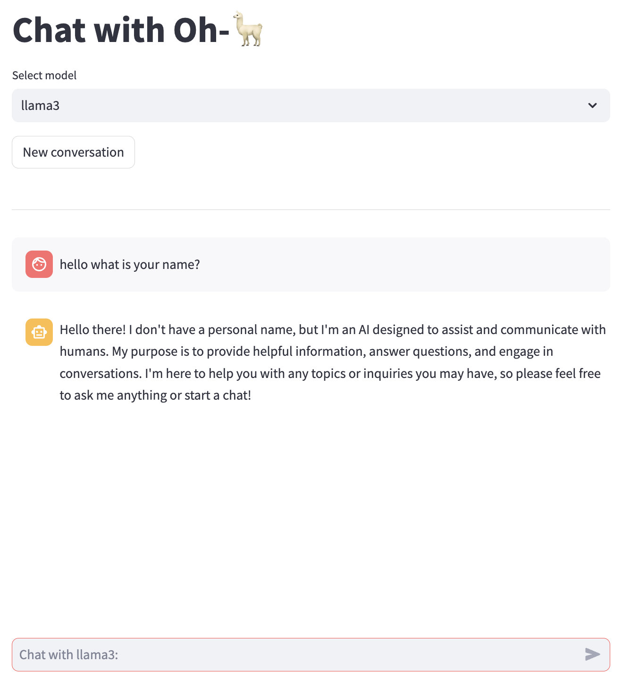

# Streamlit + Ollama + Llama3

## Overview

Welcome to this GitHub repository! Here's a brief overview of what you can find inside:

- This is a Streamlit application that utilizes Ollama as the backend.
- The Ollama backend is connected to a locally-installed Llama3 large-language-model.
- When using this app, the answers are streamed for a better user experience.



## Preparation

### 1. Install and run Ollama

Link: https://ollama.com/download

### 2. Download Llama3 model

```bash
ollama pull llama3
```

### 3. Run streamlit

```bash
pipenv install
pipenv shell
streamlit run main.py
```

Interact with the app via localhost at `http://localhost:8501`

## Contributing

Contributions are welcome! Please feel free to submit a Pull Request.
Inspired and credits to `https://github.com/joeychrys/streamlit-chatGPT.git` repository.

## License

This project is licensed under the MIT License
